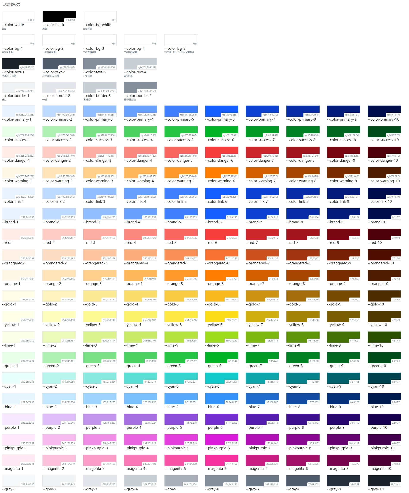
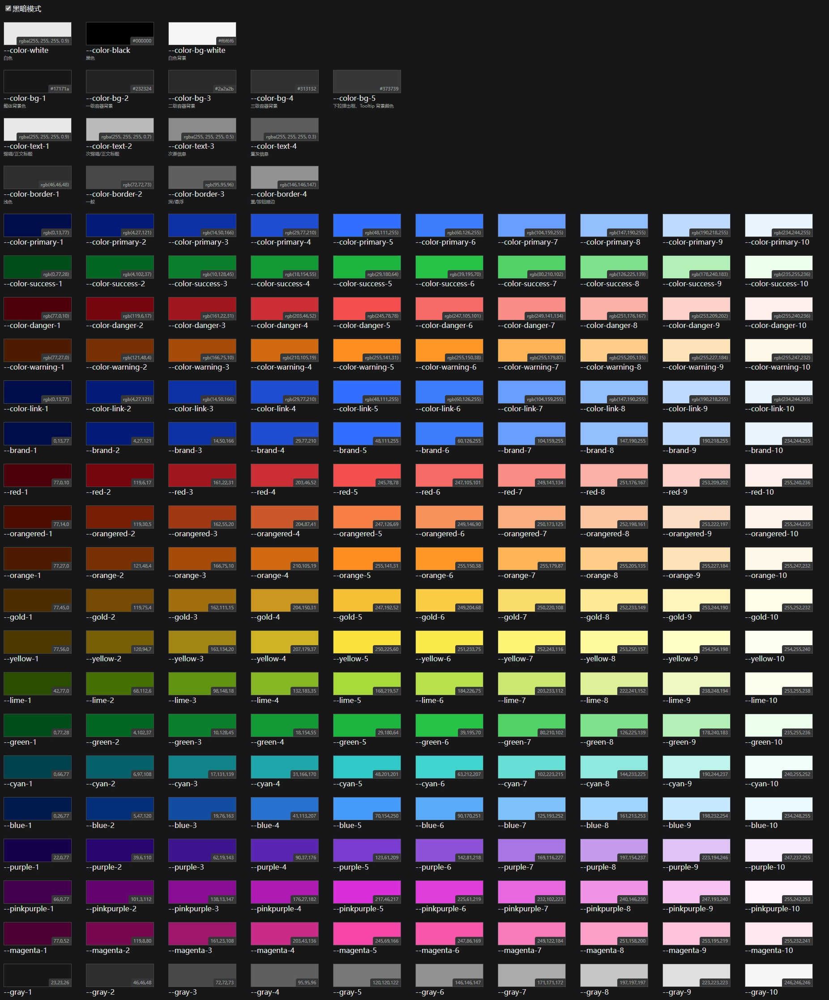

## 所有颜色变量






## 使用方法

直接使用

```
import '@devops-web/colors';
```

自定义

```
// custom.less
@import '@devops-web/colors/src/index.less';
@theme-tag: body; // 主题css变量定义的选择器
@vars-prefix: custom; // css变量的前缀
@brand-6: #9fdb1d; // 自定义主题颜色
```


## 主色

| 变量名 | CSS变量     | 描述                           |
| :----- | :---------- | :----------------------------- |
| 7      | --primary-7 | 点击（active）                 |
| 6      | --primary-6 | 常规                           |
| 5      | --primary-5 | 悬浮（hover）、边框            |
| 4      | --primary-4 | 边框（hover)                   |
| 3      | --primary-3 | 文字禁用、边框禁用、禁用背景色 |
| 2      | --primary-2 | 背景（hover）                  |
| 1      | --primary-1 | 背景                           |

### 文字颜色

| 变量名         | CSS变量         | 描述                      |
| :------------- | :-------------- | :------------------------ |
| --color-text-1 | --gray-10 | 标题/正文                 |
| --color-text-2 | --gray-8  | 描述信息                  |
| --color-text-3 | --gray-6  | 次要信息                  |
| --color-text-4 | --gray-4  | 置灰信息/禁用/placeholder |

## 边框颜色

| 变量名           | 变量值         | 描述        |
| :--------------- | :------------- | :---------- |
| --color-border-1 | --gray-2 | 浅色        |
| --color-border-2 | --gray-3 | 一般        |
| --color-border-3 | --gray-4 | 深/悬浮     |
| --color-border-4 | --gray-6 | 重/按钮描边 |

## 链接色

| 变量名   | 变量值    | 描述          |
| :------- | :-------- | :------------ |
| --color-link-7 | --brand-7 | 点击（click） |
| --color-link-6 | --brand-6 | 常规          |
| --color-link-5 | --brand-5 | 悬浮（hover） |
| --color-link-4 | --brand-4 | 特殊场景      |
| --color-link-3 | --brand-3 | 一般禁用      |
| --color-link-2 | --brand-2 | 文字禁用      |
| --color-link-1 | --brand-1 | 浅色/白底悬浮 |

## 背景颜色

| 变量名         | 变量值 | CSS变量          | 描述                         |
| :------------- | :----- | :--------------- | :--------------------------- |
| --color-bg-1     | #FFF   | --color-bg-1     | 整体背景色                   |
| --color-bg-2     | #FFF   | --color-bg-2     | 一级容器背景                 |
| --color-bg-3     | #FFF   | --color-bg-3     | 二级容器背景                 |
| --color-bg-4     | #FFF   | --color-bg-4     | 三级容器背景                 |
| --color-bg-5     | #FFF   | --color-bg-5     | 下拉弹出框、Tooltip 背景颜色 |
| --color-bg-white | #FFF   | --color-bg-white | 白色背景                     |